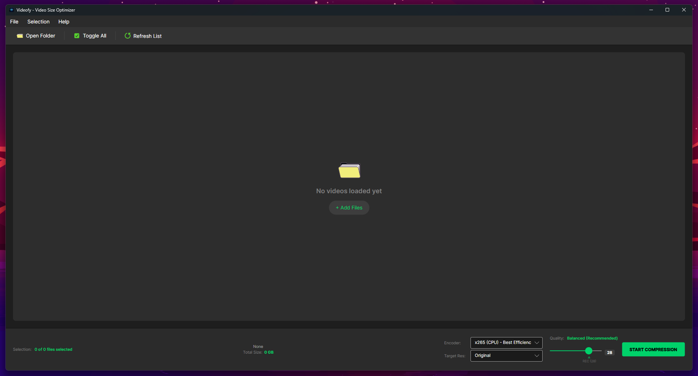
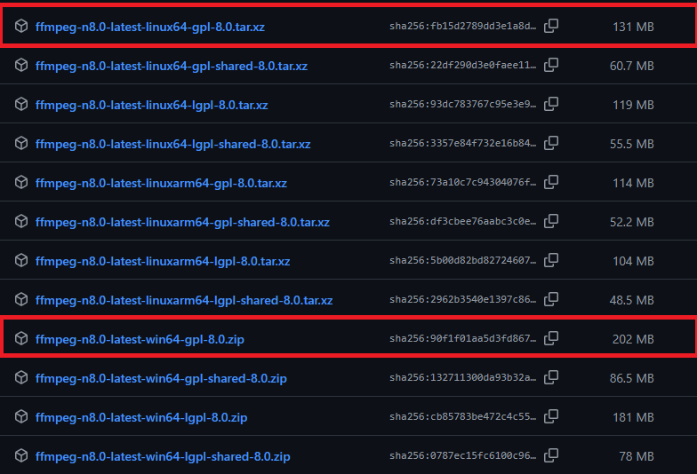

# Videofy

Videofy is an open source cross-platform desktop application for batch video compression with quality control.

Videofy is designed as a streamlined alternative to **HandBrake**. While HandBrake offers extensive features for power users, its interface can be complex. Videofy prioritizes simplicity and ease of use, making video compression accessible to everyone.

Videofy does **not** implement or distribute its own codecs.  
All video processing is performed by **FFmpeg**, which is used as an external dependency.

---

## Important Notice (v1.3.2 and Later)

Starting with **v1.3.2**, Videofy **no longer bundles FFmpeg or FFprobe binaries** with the application.

This change was made to:

- Comply with **GPL licensing requirements**
- Significantly reduce download size
- Give users full control over their FFmpeg build and feature set

As a result, **older release files have been removed** from GitHub because they contained bundled FFmpeg binaries.

---

## Project Status

**Version 1.4.1** marks the completion of the current development roadmap.
Feature suggestions and bug reports are still welcome.

---

## Features

- Batch compression of multiple video files
- Resolution downscaling during compression:
  - 4k · 2K · 1080p · 720p · 480p · 360p
- Upscale protection (prevents quality loss when source resolution is lower)
- Cross-platform support:
  - Windows
  - Linux
  - macOS: The underlying codebase supports macOS; however, official builds are currently unavailable pending hardware verification.

---

## FFmpeg Dependency (Required)

Videofy relies entirely on FFmpeg for video decoding and encoding.  
The application is a graphical frontend and does **not** include any codec implementations.

### Required FFmpeg Build

To ensure full compatibility (including **HEVC** and **hardware acceleration**), use a **GPL (non-shared)** FFmpeg build.

#### Download Instructions

1. Visit the **BtbN FFmpeg-Builds** repository [here](https://github.com/btbn/ffmpeg-builds/releases).
2. Download the latest GPL release for your OS:
   - **Windows:** `ffmpeg-n8.x -win64-gpl-8.0.zip`
   - **Linux:** `ffmpeg-n8.x -linux64-gpl-8.0.tar.xz`
3. Extract `ffmpeg` and `ffprobe` from the `bin` folder.
4. Place both files into the application's internal FFmpeg directory as instructed by the in-app setup guide.

Videofy includes a **startup dependency guard** that:

- Detects missing binaries
- Guides you directly to the correct destination folder

#### Recommended FFmpeg Version to download

## 

## How It Works

Videofy re-encodes videos using FFmpeg with **CRF (Constant Rate Factor)** settings.

- Lower CRF → higher quality, larger files
- Higher CRF → smaller files, reduced quality

This approach provides consistent visual results across different source videos.

### Best Practices

- Videos will not upscale if the source resolution is lower than selected.
- CPU (x265): Recommended CRF is 28.
- NVIDIA (NVENC): Aim for 2-5 digits LOWER than CPU (e.g., 23-25).
- AMD (AMF): Aim for 5-8 digits LOWER than CPU (e.g., 20-23).
- Intel (QSV): Similar to CPU, try 24-26 for best results.

---

## Requirements

- Windows or Linux (ARM untested)
- User-provided FFmpeg & FFprobe binaries (GPL build)
- Use full GPL builds only. LGPL, Shared, and Master builds are not supported.
- .NET runtime compatible with **.NET 8.0**

---

## Installation

1. Download the latest release from the GitHub Releases page.
2. Extract the archive.
